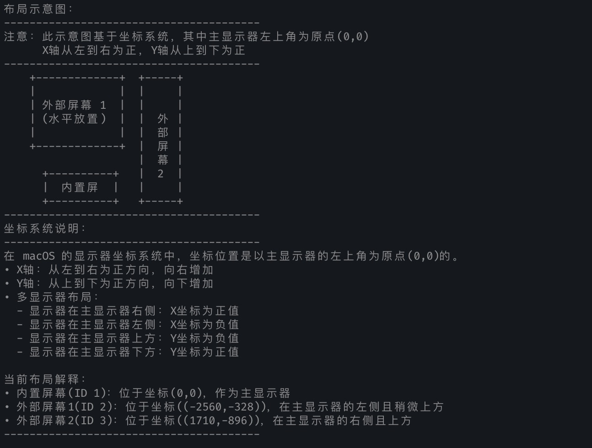

# DisplayPlacerAI - 我自己用的显示器布局管理脚本


DisplayPlacerAI 是我自己用的显示器布局管理脚本，macOS 。
它能够自动检测当前显示器状态，并根据预设配置应用最佳布局，解决了多显示器连接时常见的布局混乱问题。
对我来说：解决雷电⚡4hub，插入之后显示器会混乱，每次都要重新调整显示器的旋转和位置。

## 屏幕截图



## 使用场景

DisplayPlacerAI 特别适用于以下场景：

- **多显示器工作环境**：当您使用笔记本电脑连接多个外部显示器工作时
- **相同型号显示器**：当您连接多个相同型号的显示器，导致系统难以区分它们时
- **使用集线器或扩展坞**：当您通过 USB-C 集线器或扩展坞连接显示器，导致 Persistent ID 不稳定时
- **旋转显示器**：当您需要将某些显示器旋转 90 度使用时
- **频繁连接/断开显示器**：当您经常需要连接或断开显示器，每次都需要重新排列布局时

## 功能特点

- **智能识别显示器**：通过 Contextual ID 而非不稳定的 Persistent ID 识别显示器
- **可视化布局**：提供简单的 ASCII 布局图，帮助用户理解当前显示器排列
- **坐标系统说明**：详细解释 macOS 显示器坐标系统，帮助用户理解显示器位置
- **交互式验证**：引导用户验证布局是否正确，并提供相应的操作建议
- **配置保存/加载**：可以保存正确的配置，以便下次快速应用
- **人性化提示**：提供详细的操作指导和故障排除建议

## 前提条件

在使用 DisplayPlacerAI 之前，您需要先安装 displayplacer 工具：

### 安装 displayplacer

#### 方法 1：使用 Homebrew 安装（推荐）

如果您已经安装了 [Homebrew](https://brew.sh/)，可以使用以下命令安装 displayplacer：

```bash
brew tap jakehilborn/jakehilborn
brew install displayplacer
```

#### 方法 2：手动安装

1. 访问 [displayplacer GitHub 仓库](https://github.com/jakehilborn/displayplacer)
2. 下载最新版本的源代码
3. 按照仓库中的说明进行编译和安装

### 验证安装

安装完成后，运行以下命令验证 displayplacer 是否正确安装：

```bash
displayplacer list
```

如果显示了当前显示器的配置信息，则表示安装成功。

## 安装 DisplayPlacerAI

1. 下载 DisplayPlacerAI 脚本：

```bash
curl -o displayPlacerAI.sh https://raw.githubusercontent.com/JoeFirmament/displayPlacer/main/displayPlacerAI.sh
```

2. 赋予脚本执行权限：

```bash
chmod +x displayPlacerAI.sh
```

## 使用方法

### 基本使用

1. 打开终端
2. 导航到脚本所在目录
3. 运行脚本：

```bash
./displayPlacerAI.sh
```

4. 按照屏幕上的提示操作

### 使用流程

1. 脚本会检测当前显示器状态并显示详细信息
2. 显示当前布局的可视化图表
3. 提示您检查当前布局是否正确
4. 如果布局正确，您可以选择退出脚本
5. 如果布局不正确，脚本会提示您应用预设配置
6. 应用配置后，再次检查布局是否正确
7. 如果配置正确，您可以选择保存此配置以便将来使用

### 自定义配置

您可以编辑脚本开头的配置部分，根据自己的需求自定义显示器布局：

```bash
# 您外部显示器的原生分辨率
NATIVE_RESOLUTION="2560x1440"

# Contextual ID 1: 内置屏幕配置
CONFIG_CONTEXTUAL_1="res:1710x1112 hz:60 color_depth:8 enabled:true scaling:on origin:(0,0) degree:0"

# Contextual ID 2: 外部屏幕1配置
CONFIG_CONTEXTUAL_2="res:${NATIVE_RESOLUTION} hz:60 color_depth:8 enabled:true scaling:off origin:(-2560,-328) degree:0"

# Contextual ID 3: 外部屏幕2配置
CONFIG_CONTEXTUAL_3="res:${ROTATED_RESOLUTION} hz:60 color_depth:8 enabled:true scaling:off origin:(1710,-900) degree:90"
```

## 坐标系统说明

在 macOS 的显示器坐标系统中：

- **原点(0,0)**：位于主显示器的左上角
- **X轴**：从左到右为正方向，向右增加
- **Y轴**：从上到下为正方向，向下增加
- **多显示器布局**：
  - 显示器在主显示器右侧：X坐标为正值
  - 显示器在主显示器左侧：X坐标为负值
  - 显示器在主显示器上方：Y坐标为负值
  - 显示器在主显示器下方：Y坐标为正值

## 故障排除

如果遇到问题，请尝试以下解决方案：

1. **显示器未被正确识别**：
   - 确保所有显示器都已正确连接
   - 尝试在系统偏好设置中手动排列显示器后再运行脚本

2. **应用配置时出错**：
   - 检查显示器分辨率设置是否支持
   - 确认显示器型号和支持的分辨率

3. **鼠标移动方向不正确**：
   - 检查显示器的物理排列是否与系统中的排列一致
   - 调整脚本中的坐标配置

## 许可证

本项目采用 MIT 许可证 - 详情请参阅 [LICENSE](LICENSE) 文件。

## 致谢

- [jakehilborn/displayplacer](https://github.com/jakehilborn/displayplacer) - 提供了底层的显示器配置工具
